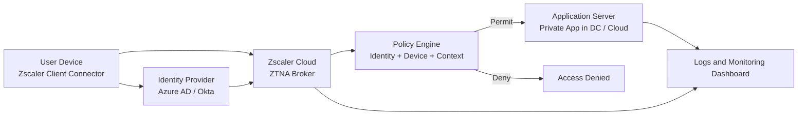
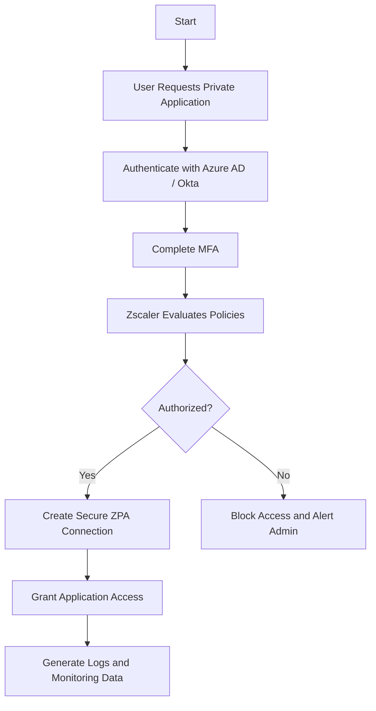

# Implementation and Management of Zero Trust Network Access (ZTNA) using Zscaler

## 1. Abstract

Zero Trust Network Access (ZTNA) is a modern security model that assumes no user, device, application, or network segment should be trusted by default, even when the request originates from inside the enterprise environment. The model enforces continuous verification of identity, device posture, context, and policy before permitting access to protected resources. This project focuses on the implementation and management of ZTNA using Zscaler, a cloud-native security platform designed to secure users, workloads, and applications without relying on traditional perimeter-based security controls.

In modern cloud-based and hybrid work environments, employees, contractors, and third-party users frequently access enterprise applications from unmanaged networks and remote locations. Traditional Virtual Private Network (VPN) solutions create broad network-level connectivity, which increases the attack surface and can expose internal resources if credentials are compromised. Zscaler addresses this challenge by providing application-level access through Zscaler Private Access (ZPA), identity-aware policy enforcement, secure connectivity, and centralized visibility.

The purpose of this project is to study, design, and demonstrate how Zscaler-based ZTNA can be used to secure enterprise application access. The project explains the system architecture, implementation workflow, policy management process, and operational advantages of the solution. It also highlights limitations, future improvements, and practical deployment steps suitable for academic and industry-oriented understanding.

## 2. Introduction

Traditional network security models were built around the concept of a trusted internal network protected by a strong perimeter. Firewalls, VPN gateways, and intrusion prevention systems were designed to keep malicious traffic outside while allowing trusted internal users broad access to network resources. This approach was effective when organizations primarily operated from centralized offices, hosted applications in local data centers, and managed a limited number of corporate devices.

That model is no longer sufficient. Modern enterprises use cloud applications, Software as a Service (SaaS), remote work, bring-your-own-device policies, and third-party integrations. Users connect from home networks, public Wi-Fi, mobile networks, and branch offices. Applications are distributed across on-premises environments, private clouds, and public clouds. As a result, the traditional network perimeter has dissolved.

When a traditional VPN grants remote access, it often places the user inside the corporate network after authentication. This creates excessive trust and can allow lateral movement, privilege misuse, and unauthorized access to systems that the user should never reach. Attackers exploit this model through stolen credentials, malware, phishing, and compromised endpoints.

Zero Trust Architecture (ZTA) was introduced to solve these weaknesses. The core principle of Zero Trust is "never trust, always verify." Every access request is evaluated dynamically using identity, device health, location, application sensitivity, and organizational policy. Instead of granting broad network access, Zero Trust provides least-privilege access only to specific authorized applications or services.

Zscaler is one of the most widely adopted cloud security platforms for implementing Zero Trust. Through services such as Zscaler Private Access (ZPA) and Secure Web Gateway (SWG), it enables secure, identity-driven, policy-enforced access without exposing internal applications to the internet or placing users on the internal network.

## 3. Problem Statement

Organizations that depend on traditional VPN-based remote access face multiple security and management problems. VPNs authenticate users and then extend network-level access into the enterprise environment. Even when segmentation exists, this model commonly permits more access than necessary and creates a larger attack surface.

The main problems in traditional VPN-based environments are as follows:

1. Unauthorized access: If an attacker steals valid user credentials, the VPN may allow entry into the internal network, after which the attacker can probe or exploit internal systems.
2. Data breaches: Once connected, users or malware may reach multiple internal resources, increasing the likelihood of data leakage, ransomware spread, or unauthorized exfiltration.
3. Insider threats: Employees or contractors with excessive permissions can intentionally or unintentionally access sensitive systems beyond their job role.
4. Lack of granular control: Traditional VPN solutions focus on network connectivity rather than application-level, identity-based access control.
5. Complex management: Administrators must maintain concentrators, firewall rules, IP ranges, split tunneling, and network segmentation, which can become difficult at scale.
6. Poor user experience: VPN latency, repeated connectivity issues, and traffic backhauling reduce performance for remote users.

This project addresses these issues by proposing and documenting a Zero Trust implementation using Zscaler, where users are authenticated, validated, and connected only to approved applications based on defined policies.

## 4. Objectives of the Project

The key objectives of this project are:

1. To implement a Zero Trust security model for enterprise application access.
2. To secure remote access using Zscaler ZTNA, specifically Zscaler Private Access (ZPA).
3. To provide identity-based and context-aware access control using an Identity Provider (IdP) such as Azure AD or Okta.
4. To monitor and manage network access policies from a centralized cloud security platform.
5. To reduce the attack surface by removing direct application exposure and eliminating dependence on legacy VPN access.
6. To demonstrate a practical academic deployment workflow suitable for a BSc or B.Tech final year project.

## 5. Literature Survey

Network security has evolved through several phases, each designed to address the dominant threat model of its time.

### 5.1 Traditional Perimeter Security

Traditional security architecture relied on perimeter defenses such as firewalls, VPN gateways, demilitarized zones (DMZs), and access control lists. This architecture assumed that systems inside the network were trusted and that threats were mostly external. While effective for centralized enterprise networks, the model struggles in decentralized and cloud-first environments.

### 5.2 Castle-and-Moat Model

The castle-and-moat model gives strong protection at the boundary but weak internal controls once a user crosses the perimeter. This can enable insider misuse and lateral movement by attackers. Multiple studies and industry breach reports have shown that internal trust assumptions significantly increase breach impact.

### 5.3 VPN-Based Remote Access

VPNs encrypt traffic between the user and the enterprise gateway, which is beneficial for confidentiality in transit. However, most VPNs operate at the network layer and are not inherently application-aware. Research and industry practice show that VPNs remain vulnerable to credential theft, device compromise, and network overexposure.

### 5.4 Zero Trust Architecture

Zero Trust Architecture was formalized in guidance from organizations such as the National Institute of Standards and Technology (NIST), especially NIST SP 800-207. Zero Trust rejects implicit trust based on location or network presence. It requires continuous verification of users and devices, least-privilege access, segmentation, and ongoing monitoring.

### 5.5 Secure Access Service Edge (SASE) and Cloud Security

Modern security literature also emphasizes the convergence of networking and security in the cloud through SASE. Vendors such as Zscaler, Palo Alto Networks, Netskope, and Cloudflare provide cloud-delivered security services that combine ZTNA, SWG, CASB, and data protection. Zscaler is particularly recognized for cloud-native proxy architecture and application segmentation using ZPA.

### 5.6 Comparison of Existing Models and Zero Trust

| Security Model | Trust Basis | Access Type | Main Weakness | Suitability for Modern Cloud Environments |
| --- | --- | --- | --- | --- |
| Traditional Perimeter | Network location | Broad internal access | Implicit trust inside network | Low |
| Castle-and-Moat | Boundary defense | Internal network exposure | Lateral movement risk | Low |
| VPN-Based Access | User login plus tunnel | Network-level access | Over-privileged connectivity | Medium-Low |
| Zero Trust Architecture | Identity, device, policy, context | Application-level least privilege | Requires mature policy design | High |
| Zscaler ZTNA | Cloud-delivered identity-aware access | Granular app access | Subscription and setup complexity | Very High |

The literature clearly indicates that Zero Trust offers better alignment with current enterprise requirements than traditional remote access methods.

## 6. Technologies Used

### 6.1 Zero Trust Security Model

The Zero Trust Security Model is a cybersecurity framework in which no entity is trusted by default. Each access request is evaluated continuously based on identity, device posture, risk, location, and policy. The model emphasizes:

1. Verify explicitly.
2. Use least-privilege access.
3. Assume breach.
4. Continuously monitor user and device behavior.

### 6.2 Zscaler Cloud Security Platform

Zscaler is a cloud-native cybersecurity platform that delivers security as a service. Instead of routing traffic to on-premises appliances, traffic is processed through distributed cloud security nodes. This improves scalability, centralized management, visibility, and policy consistency.

Core security functions provided by Zscaler include:

1. Zero Trust Network Access.
2. Secure Web Gateway.
3. Cloud firewall and traffic inspection.
4. Data protection controls.
5. Threat detection and policy analytics.

### 6.3 Zscaler Private Access (ZPA)

ZPA is Zscaler's Zero Trust Network Access solution. It provides secure, direct, application-specific access to private applications without exposing those applications to the public internet. ZPA brokers connections between authenticated users and internal applications through the Zscaler cloud. It avoids inbound connectivity requirements and hides application IP addresses.

Key functions of ZPA include:

1. Application segmentation.
2. Identity-aware policy enforcement.
3. Brokered access between users and apps.
4. Support for remote and hybrid users.
5. Reduced risk compared to traditional VPN.

### 6.4 Identity Providers (Azure AD / Okta)

Identity Providers validate users and provide authentication and group information. In a ZTNA deployment, the IdP acts as the source of identity truth. Azure AD and Okta commonly support SAML, OpenID Connect, SCIM, and Multi-Factor Authentication. Zscaler integrates with these providers to enforce role-based and identity-based access decisions.

### 6.5 Multi-Factor Authentication (MFA)

MFA requires at least two different verification factors, such as password plus mobile authenticator or biometric verification. MFA significantly reduces the risk of unauthorized access due to stolen credentials and is an essential part of Zero Trust enforcement.

### 6.6 Secure Web Gateway (SWG)

A Secure Web Gateway protects users when accessing internet resources by filtering web traffic, blocking malicious domains, enforcing acceptable use policies, and inspecting content. In the broader Zscaler ecosystem, SWG complements ZTNA by securing outbound web access while ZPA secures private application access.

## 7. System Architecture

The proposed ZTNA architecture using Zscaler consists of five major components: User Device, Zscaler Cloud, Identity Provider, Application Server, and Policy Engine.

### 7.1 Components

1. User Device: A laptop, desktop, or mobile device used by employees or authorized users. The device runs the Zscaler Client Connector, which forwards user traffic and posture information to the Zscaler cloud.
2. Zscaler Cloud: The central control and enforcement layer that brokers secure application access. It evaluates user identity, device posture, and configured access policies.
3. Identity Provider: Azure AD or Okta authenticates the user and may enforce MFA. It provides group membership and identity attributes to Zscaler.
4. Application Server: The protected internal application hosted in a data center, branch office, or cloud environment.
5. Policy Engine: A logical enforcement function inside the Zscaler platform that checks whether the user and device satisfy the access policy for the requested application.

### 7.2 Architecture Explanation

When a user attempts to access a private application, the request is first intercepted by the Zscaler Client Connector on the endpoint. The client redirects the access attempt to the Zscaler cloud. Zscaler then requests identity validation through the configured IdP. Once the user's identity is confirmed, the policy engine evaluates contextual conditions such as user role, device trust, application sensitivity, network location, and MFA state.

If the request meets the policy requirements, Zscaler brokers a secure outbound connection to the application server through the ZPA service. The application remains hidden from the public internet because there is no direct inbound exposure. If the request fails identity, posture, or policy checks, access is denied. This design ensures least-privilege access, isolates applications, and limits attack paths.

### 7.3 Architecture Diagram

## 8. System Workflow

The workflow of ZTNA using Zscaler can be described in a sequence of controlled access decisions.

### 8.1 Step-by-Step Workflow

1. User login: The user launches the enterprise application from a registered device that has the Zscaler Client Connector installed.
2. Authentication: The Zscaler platform redirects the user to the Identity Provider for authentication. The user enters credentials and completes MFA.
3. Policy verification: Zscaler receives identity attributes and checks access rules such as user group, device health, posture status, location, and application entitlement.
4. Secure connection: If the request is authorized, ZPA brokers an encrypted connection between the user and the specific application.
5. Application access: The user gains access only to the allowed application and not to the entire network.
6. Monitoring and logging: Access events, policy decisions, and user activities are logged for visibility and auditing.

### 8.2 Workflow Diagram

## 9. Implementation Steps

This section presents a practical implementation approach suitable for a lab-based final year project. The exact menu names may vary slightly depending on the Zscaler tenant version, but the sequence remains valid.

### Step 1: Create Zscaler Account

1. Register for a Zscaler tenant or use a sandbox, demo, or institutional lab tenant.
2. Log in to the Zscaler administrative portal.
3. Configure the organization name, administrator accounts, and domain information.
4. Enable the required services, especially Zscaler Private Access.

Expected output:
The organization has a managed Zscaler tenant ready for configuration.

### Step 2: Configure Identity Provider

1. Select an IdP such as Azure AD or Okta.
2. In the IdP portal, create an enterprise application for Zscaler.
3. Configure SAML or OIDC federation settings.
4. Map user groups such as Employees, Admins, and Contractors.
5. Enable MFA for all privileged and remote access users.
6. Test the authentication flow between the IdP and Zscaler.

Expected output:
Zscaler can authenticate users via the configured IdP and retrieve group membership for access policy decisions.

### Step 3: Configure Zscaler Private Access (ZPA)

1. Add application segments in ZPA for the internal applications that need protection.
2. Configure server groups or application connectors for workloads hosted in the data center or cloud.
3. Ensure outbound connectivity from application connectors to the Zscaler cloud.
4. Verify that internal applications are no longer exposed directly to the public internet.

Expected output:
Private applications become reachable only through the ZPA broker.

### Step 4: Define Access Policies

1. Create user access policies based on identity, group, department, location, and device posture.
2. Apply least-privilege rules so users only access required applications.
3. Add conditions for MFA, trusted devices, and risk-based restrictions.
4. Create separate policies for administrators, employees, and third-party vendors.
5. Test both allow and deny scenarios.

Expected output:
Granular application access is enforced using centralized policy rules.

### Step 5: Deploy Zscaler Client Connector

1. Download the Zscaler Client Connector installer.
2. Deploy it on user devices manually or through endpoint management tools such as Intune or SCCM.
3. Register the client with the Zscaler tenant.
4. Confirm that device posture and user identity are visible in the admin console.

Expected output:
User devices can communicate securely with Zscaler and participate in policy-based access decisions.

### Step 6: Test Secure Access

1. Attempt access to a permitted internal application from a trusted user device.
2. Attempt access to a restricted application using a user without entitlement.
3. Test login without MFA, from an untrusted device, or from a blocked location if such rules are defined.
4. Review Zscaler logs and policy hits.
5. Record results with screenshots for demonstration and viva presentation.

Expected output:
Permitted users gain secure application access, while unauthorized requests are denied and logged.

## 10. Advantages of ZTNA

ZTNA using Zscaler provides several important benefits:

1. No VPN dependency: Users are connected directly to authorized applications without extending network-level access.
2. Strong identity verification: Access depends on identity validation, MFA, device posture, and policy context.
3. Reduced attack surface: Private applications are hidden from public discovery and not directly exposed to inbound internet traffic.
4. Secure cloud access: The architecture is designed for cloud, hybrid, and remote work environments.
5. Better user experience: Users connect to specific applications without the latency and overhead of full-tunnel VPN architectures.
6. Centralized visibility: Security teams can monitor policies, user sessions, and access logs from a unified console.
7. Least-privilege enforcement: Users gain only the application access required for their job role.

## 11. Limitations

Although ZTNA offers strong security advantages, some limitations and challenges must be recognized:

1. Cost: Enterprise-grade ZTNA platforms such as Zscaler require subscription licensing that may be expensive for small organizations.
2. Configuration complexity: Proper integration with identity, connectors, applications, and posture rules requires planning and skilled administration.
3. Cloud dependency: Because policy enforcement and brokering are cloud-based, service availability and internet connectivity become critical factors.
4. Learning curve: Security and network teams may need training to transition from network-centric access models to application-centric Zero Trust controls.
5. Legacy application compatibility: Some older applications may require additional configuration or connector tuning to work properly with ZTNA.

## 12. Future Enhancements

The project can be expanded in several directions for future academic research or real-world enterprise deployment:

1. AI-based threat detection: Integrate behavioral analytics and machine learning to detect anomalous user behavior and adjust access decisions dynamically.
2. Automated policy management: Use risk scoring and orchestration to automatically adapt access policies based on device posture, user activity, and threat intelligence.
3. Integration with Security Information and Event Management (SIEM): Forward Zscaler logs to platforms such as Microsoft Sentinel or Splunk for advanced monitoring and incident response.
4. Continuous device trust assessment: Expand posture checks to include operating system patch levels, endpoint detection status, encryption, and compliance posture.
5. Unified SASE deployment: Combine ZTNA, SWG, CASB, and Data Loss Prevention into a broader cloud security framework.
6. Micro-segmentation and workload protection: Extend Zero Trust principles beyond user access into server-to-server and workload-to-workload communications.

## 13. Conclusion

The implementation and management of Zero Trust Network Access using Zscaler represents a major improvement over traditional VPN-based remote access. Instead of trusting users after network login, Zscaler continuously verifies identity, device posture, and contextual conditions before allowing application access. This reduces attack surface, prevents broad internal exposure, supports least-privilege access, and improves security for modern cloud-based and hybrid enterprises.

This project demonstrates that Zscaler ZTNA, particularly through ZPA integrated with an Identity Provider and MFA, provides a practical and scalable framework for securing remote access to enterprise applications. Although the architecture introduces some cost and administrative complexity, the security advantages are substantial. For organizations moving toward cloud-first operations and distributed workforces, ZTNA offers a more resilient and future-ready access model.

## 14. References

1. Rose, S., Borchert, O., Mitchell, S., and Connelly, S. NIST Special Publication 800-207: Zero Trust Architecture. National Institute of Standards and Technology, 2020.
2. Kindervag, J. Build Security Into Your Network's DNA: The Zero Trust Network Architecture. Forrester Research.
3. Zscaler Documentation. Zscaler Private Access Administration and Deployment Guides. Available from the official Zscaler documentation portal.
4. Microsoft Documentation. Azure Active Directory SAML and Conditional Access Documentation.
5. Okta Documentation. Application Integration and Multi-Factor Authentication Documentation.
6. Stallings, W. Network Security Essentials: Applications and Standards. Pearson.
7. Singh, S., and Sharma, P. Research trends in Zero Trust security architecture for cloud environments. International Journal of Information Security, various editions.
8. Cloud Security Alliance. Software-Defined Perimeter and Zero Trust guidance papers.
9. Zscaler Whitepapers on Zero Trust Exchange, ZPA, and cloud-delivered security architecture.

## Security Flow Explanation

The security flow begins when a user attempts to access a private application from a managed or unmanaged device. The Zscaler Client Connector identifies the request and sends it to the Zscaler cloud. The user's identity is verified by the IdP using credentials and MFA. Once authenticated, the Zscaler policy engine evaluates whether the device, user role, application, and context satisfy the organization's access policy. If the conditions are met, ZPA brokers a secure connection to the application using outbound-only connectivity through the application connector. The user receives access only to the approved application, not the full internal network. All actions are logged for auditing and incident response.

## Suggested Screenshots for Demonstration

The following screenshots are recommended for the practical demonstration and project report:

1. Zscaler admin portal home page showing tenant overview.
2. IdP integration page showing Azure AD or Okta SAML configuration.
3. MFA prompt during user authentication.
4. ZPA application segment configuration screen.
5. Access policy screen showing user groups and allow or deny rules.
6. Zscaler Client Connector dashboard on the endpoint device.
7. Successful application access from an authorized device.
8. Blocked access attempt for an unauthorized user or non-compliant device.
9. Monitoring or analytics dashboard showing logs, users, and policy hits.

## Viva / Demonstration Notes

If this project is presented in a viva or seminar, the student should emphasize the following:

1. Zero Trust is different from VPN because it does not provide full network access.
2. Zscaler hides applications from the internet and brokers access through the cloud.
3. Identity, MFA, and device posture are central to policy enforcement.
4. The policy engine ensures least-privilege access.
5. The architecture is well suited for remote work, hybrid cloud, and modern enterprises.

## Sample Deployment Scenario for Academic Demonstration

Consider a company with three user categories: Employees, Administrators, and Vendors. The company hosts an HR application in a private data center and a Finance application in a cloud VPC. Employees should access only the HR application, Administrators should access both applications, and Vendors should access neither unless explicitly approved. ZPA application segments are created for HR and Finance. Azure AD provides group-based identity, and MFA is required for all roles. A trusted device posture policy is applied. The result is that each user gets access only to authorized applications, blocked attempts are logged, and no VPN tunnel is required.

## Project Outcome

By completing this project, the student demonstrates understanding of:

1. Traditional and modern network security models.
2. Zero Trust principles and their real-world relevance.
3. Zscaler architecture and ZPA deployment workflow.
4. Identity integration and policy-based access control.
5. Monitoring, governance, and secure remote application delivery.
